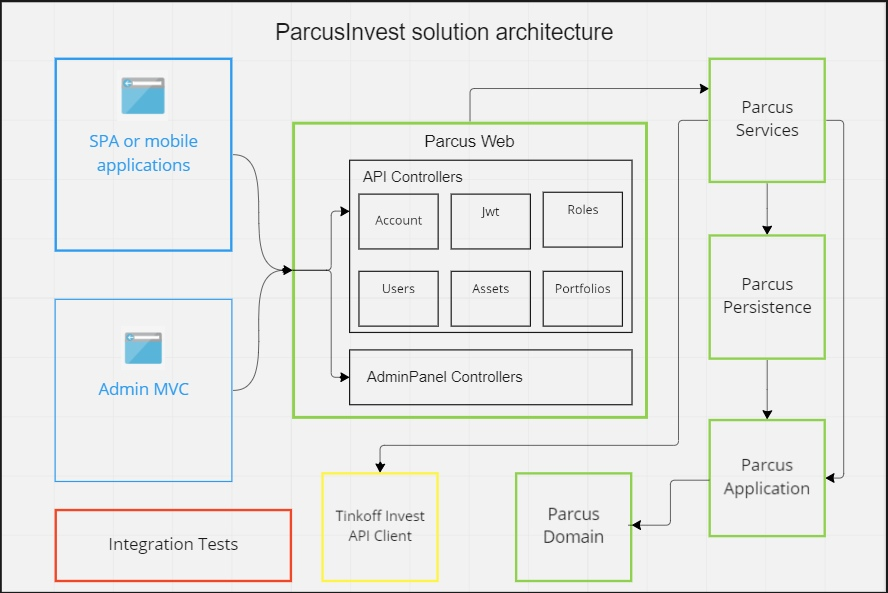

# Parcus
---
Parcus API - REST API for accounting, analysis and investment portfolio management.
The service also provides open access to obtaining information on assets by [figi](https://en.wikipedia.org/wiki/Financial_Instrument_Global_Identifier).

## Principles
---
The main principle is to provide front-end and mobile developers with the ability to create investment applications without developing a back-end part, but use a ready-made solution.
## Architecture Overview
The following diagram illustrates the high-level architecture and main areas of Parcus Invest solutions:



As you can see from the diagram, the application uses a **CLEAN ARCHITECTURE**.

## Introduction to Parcus Invest
For information about using the API, you can refer to the following sources.

* [Documentation of API](https://parcusinvest.somee.com/docs/index.html)

The service is not supposed to start when cloning the repository because of security reasons, however, after adding the demo [appsettings file](docs/startup/applicationsettings.json) and filling it with valid data in your case in Parcus Web folder, application can be launched.
Important parameters to set in [appsettings file](docs/startup/applicationsettings.json).
```
"ConnectionString": "YOUR_CONNECTIONSTRING_TO_SQLSERVER_DATABASE"
"Secret": "YOUR_SECRETKEY_FOR_ENCRYPT_JWT_TOKEN"
"ReadonlyToken": "YOUR_INVEST_API_TOKEN"
``` 

## Technology Stack Used

The project was created using the following technologies:

* .NET Core and ASP.NET Core as base platform;
* EF Core as primary ORM;
* ASP.NET Core Identity for authentication and authorization;
* ASP.NET Core Authorization for OAuth authorization;
* WebPack as primary design/runtime bundler and minifier of adminpanel and main page;
* Swashbuckle.AspNetCore.SwaggerGen for Swagger docs and UI;
* HangFire for run background tasks;
* [Tinkoff Invest](https://github.com/Tinkoff/invest-api-csharp-sdk) SDK.
